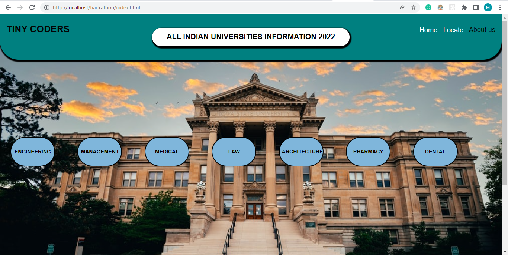
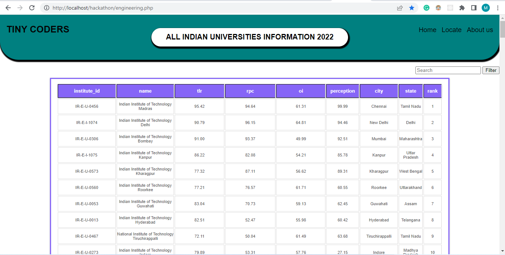
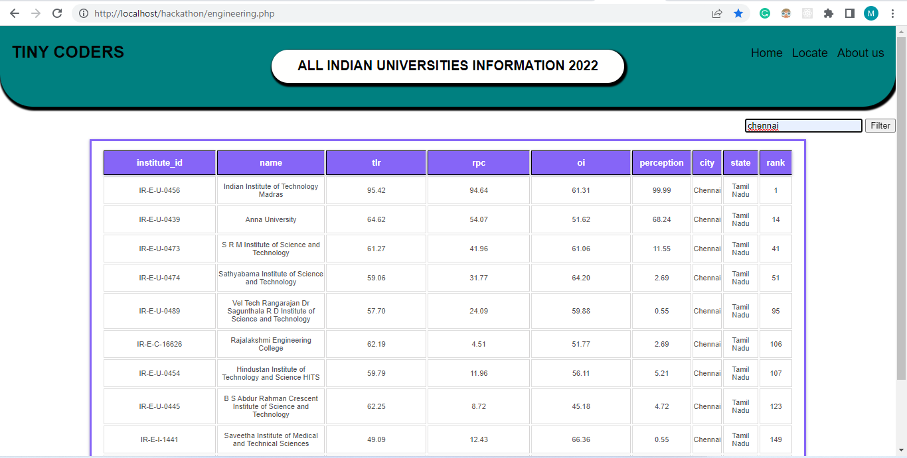
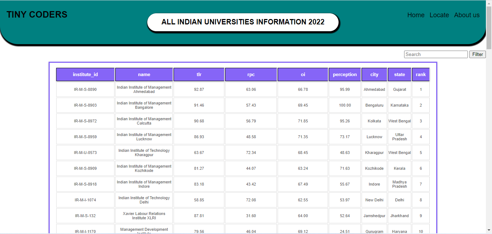
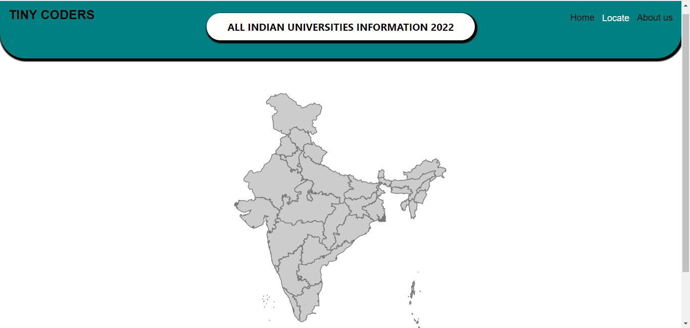
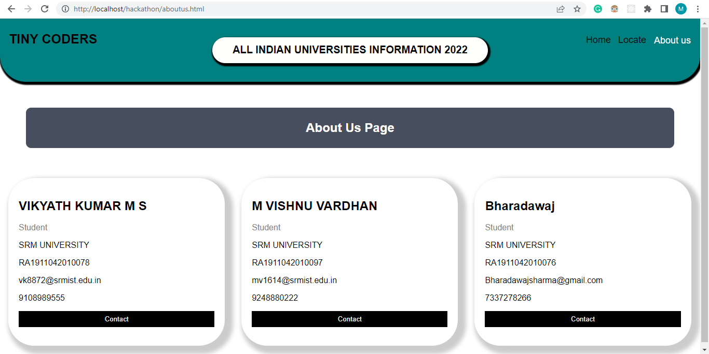

# Hackathon Project

## Task: To develop an Integrated Information platform for information of Indian universities
Description: This website is a source of all the details of universities in India according to their ranking based on different criteria. This website helps students and professors to evaluate in any aspect as they require.

Deployment Link : https://my-fullstack-project1.000webhostapp.com/index.html
# Technologies used:
•	HTML
•	CSS
•	PHP
•	SQL

# Screenshot:

Made By:

Mahajan vishnu

Vishnumahajan33@gmail.com
